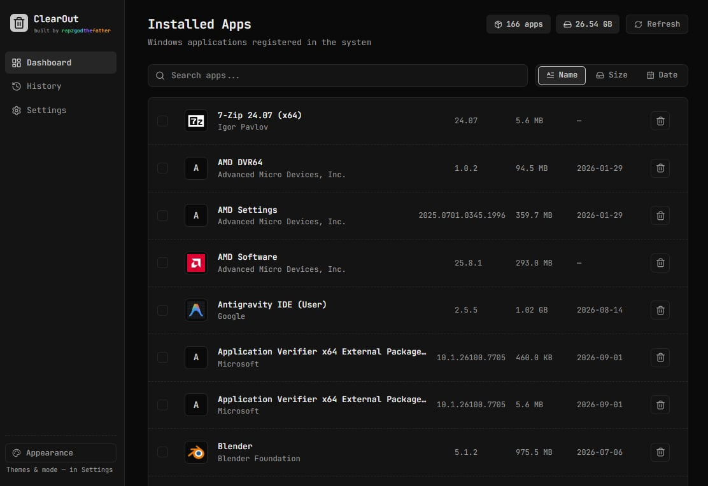
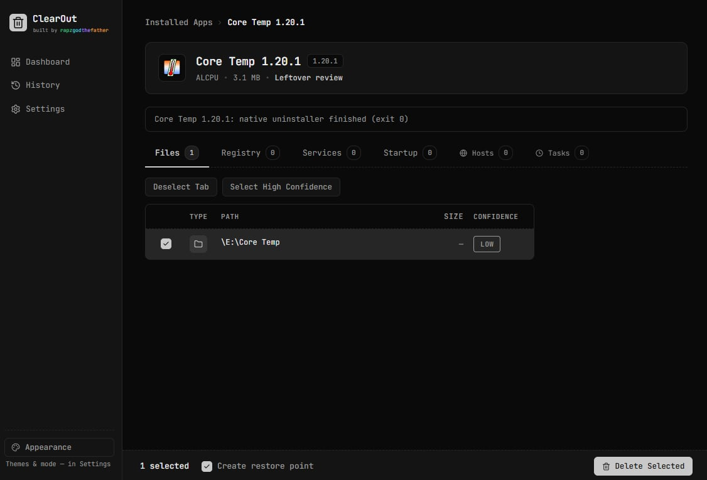
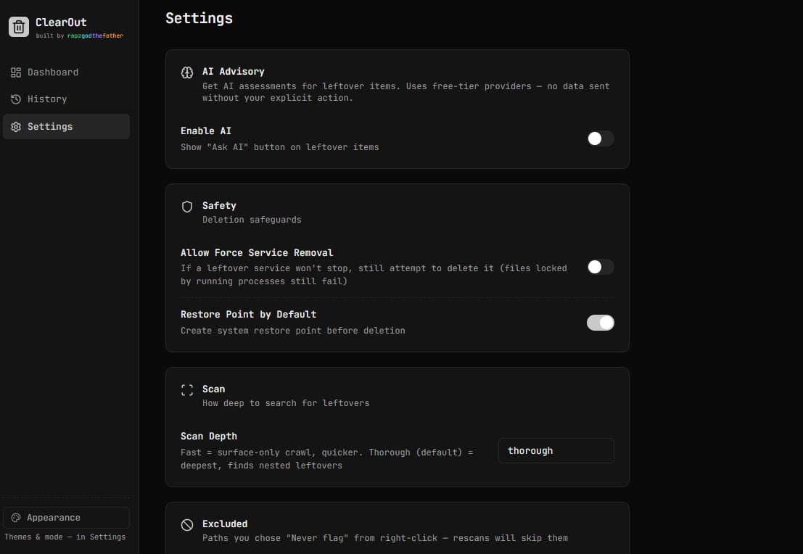

# ⚡ ClearOut

A deep Windows uninstaller with a terminal-console soul. It runs an app's own uninstaller, then scans for the files, registry keys, services, and startup entries it left behind — review everything with confidence scores, and remove it safely with reversible backups.

**Free. Open-source. No ads. No bloatware. No telemetry.**

> **Status:** v0.1.0 · Windows 10/11 · beta — test on disposable apps first.

## Download

Grab the latest installer from [Releases](https://github.com/rapzzzzz/clearout/releases).

> Builds are **unsigned** — SmartScreen warns on first launch. Click **More info → Run anyway**. Normal for open-source software without a paid code-signing certificate.
>
> **Run as administrator** for full power: leftover service removal and restore points need elevation (the app shows a banner when it isn't elevated).

## Screenshots





## Features

- **Installed-app inventory** — live list from Windows registry with icons, publisher, size, install date; search + sort; batch queue.
- **Native uninstall, then scan** — launches the app's own uninstaller (or `msiexec` for MSI), waits for it, then hunts leftovers. Files of apps still installed are **locked** so you can't delete them by accident.
- **Force-remove mode** — uninstaller missing or broken? Deep-scan everything belonging to the app and remove it manually.
- **Deep leftover scan** — files, registry, services, startup entries. Windows system services are excluded by binary path, not just name.
- **Confidence scoring** — every item rated High/Medium/Low before you delete anything.
- **Reversible deletion** — optional system restore point first (default on); files go to soft trash, restorable 7 days; registry subtrees backed up, restorable 30 days; verify button re-scans; nothing deletes until you tick items and confirm.
- **Reports** — JSON + TXT auto-saved to `%APPDATA%\ClearOut\reports`, listed in History.
- **AI advisory (opt-in)** — per-item analysis via your own Groq or OpenRouter key. Sends the item path and name only. Off by default.
- **Console themes** — JetBrains Mono UI, true-black dark or paper light, 5 accent families.

## Safety

- Protected system paths (`C:\Windows` and friends) are never deletable, whatever you select.
- Windows-owned services are filtered by binary path; deletion refuses them defensively.
- Registry keys are snapshotted (raw values, lossless) before removal — restore from History.
- Files go to ClearOut's soft trash first, restorable for 7 days.
- Every deletion needs your explicit selection + confirmation dialog.

## Privacy

- No telemetry, no analytics, no network calls on startup.
- Only network traffic: the opt-in AI advisor with your own key — sends the item path and name, never file contents.
- Settings, reports, soft trash, and registry backups all stay on your machine.

## Known limits (v0.1)

- Unsigned binary (SmartScreen warning).
- No auto-updater — install new releases from GitHub.
- Deep registry scan matches key *names*; value-level matching (CLSID `LocalServer32` etc.) is on the roadmap.
- Lock handling is a lightweight probe, not full Windows Restart Manager.

## Build from source

Prerequisites: [Rust (MSVC)](https://rustup.rs/), [Node.js](https://nodejs.org/) 20+, [VS Build Tools](https://visualstudio.microsoft.com/visual-cpp-build-tools/) ("Desktop development with C++").

```bash
git clone https://github.com/rapzzzzz/clearout.git
cd clearout
npm install
npm run tauri dev    # development (hot reload)
npm run tauri build  # installer → src-tauri/target/release/bundle/
```

## License

[MIT](LICENSE) © 2026 rapzzzzz
